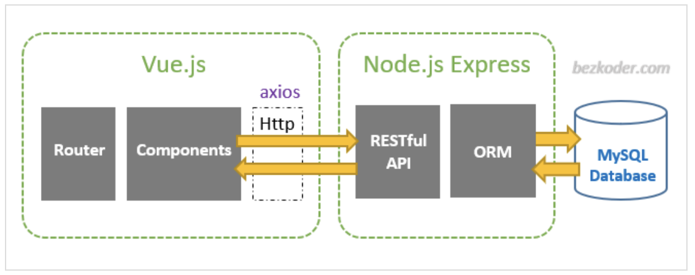

# Connecting Vue.js front-end to Node.js backend

## REST Basics

Client - app itself (frontend)
Server - backend services

Client can call on the server using HTTP requests

REST - Representations State Transfers

- Create, Read, Update, and Delete data (CRUD)

Example - Vidly company for renting out movies

endpoint = http://vidly.com/api/customers
'/api' == not required, but commonly used way to signify that you are working with the api
'/customers' == resource

type of request determines the type of operation

every HTTP request has a verb (GET, POST, PUT, DELETE)

**MOST COMMON HTTP VERBS**
GET /api/customers [get all customers]
GET /api/customers/1 [get specific customer]
POST /api/customers, {name: ''} [create new customer with provided req.body]
PUT /api/customer/1, {name: ''} [updates specific customer with provided req.body]
DELETE /api/customer/1 [deletes specific customer]

## Tools

### Express.js
Lightweight framework built on top of the http module in node.js 

Manually defining routes in plain node.js is tedious and prone to bugs due to length of code 

### Axios

## Resources

[Connecting Front end and back end: Vue.js full-stack tutorial](https://www.youtube.com/watch?v=fMvXd9BIwiw)

[Integrating Vue.js with Backend Frameworks](https://medium.com/@emperorbrains/integrating-vue-js-with-backend-frameworks-node-js-django-and-beyond-606d6a2f53a7)

[Building a Simple Web App with Vue.js and Node.js](https://medium.com/@samturquoise/building-a-simple-web-application-with-vue-js-and-node-js-a-beginners-guide-66bef468118a)

[Quick & dirty: How to deploy a fullstack Vue.js app with a working node.js backend](https://dev.to/tqbit/quick-dirty-how-to-deploy-a-fullstack-vue-js-app-with-a-working-node-js-backend-51k4)

[Vue.js + Node.js + Express + MySQL example: Build a full-stack CRUD Application](https://www.bezkoder.com/vue-js-node-js-express-mysql-crud-example/)

[MEVN stack tutorial | Build a CRUD app using Vue 3, Node, Express & MongoDB](https://signoz.io/blog/mevn-stack-tutorial/)

[CRUD API Tutorial – Node, Express, MongoDB](https://www.youtube.com/watch?v=_7UQPve99r4)
